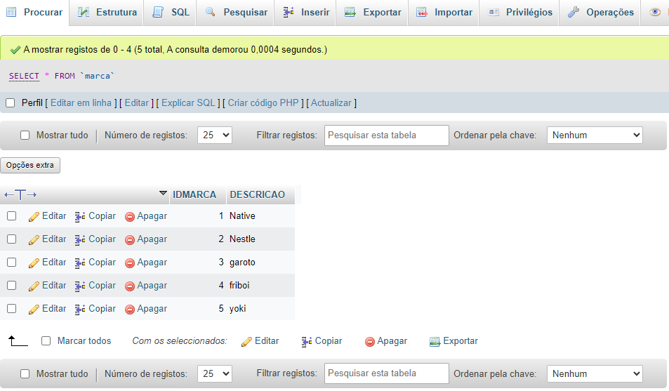

# Cadastros-de-ecommerce-documentados

# Índice 

[Cadastros-de-ecommerce-documentados](#cadastros-de-ecommerce-documentados-1)  
[Descrição](#descri%C3%A7%C3%A3o)  
[Funcionalidades](#funcionalidades)    
[Composição do Projeto](#%EF%B8%8Fcomposi%C3%A7%C3%A3o-do-projeto)   
[Funções em PHP](#fun%C3%A7%C3%B5es-em-php)  
[Funções em Javascript](#fun%C3%A7%C3%B5es-em-javascript)   
[Tecnologias Utilizadas](#%EF%B8%8Ftecnologias-utilizadas)  
[Fontes consultadas](#fontes-consultadas)  
[Colaboradores](#colaboradores)  
[Autores](#%EF%B8%8Fautores)  

# Modelo da "MARCA" cadastrada com sucesso:    

  

# 📌Cadastros-de-ecommerce-documentados  

## 📝Descrição  
 * Este projeto é uma aplicação web desenvolvida para gerenciar o cadastro de produtos em um sistema de e-commerce. O objetivo principal é fornecer uma interface simples e funcional para adicionar e gerenciar categorias, marcas e produtos em um banco de dados MySQL. A aplicação utiliza PHP para o backend e HTML/CSS para o frontend, com suporte a operações básicas de CRUD (Create, Read, Update, Delete) para a gestão de dados.

## 🔛Funcionalidades   
 * O Sistema de Cadastro e Gestão de Produtos oferece diversas funcionalidades para a administração de produtos em um ambiente de e-commerce. As principais funcionalidades incluem:
   
   ### 1. Cadastro de Categorias
   * Descrição: Permite o cadastro de novas categorias que serão usadas para classificar os produtos.  
   * Funcionamento: O usuário preenche um formulário com a descrição da categoria e, ao enviar, a categoria é salva no banco de dados.
  
   ### 2. Cadastro de Marcas
   * Descrição: Permite o cadastro de novas marcas que serão associadas aos produtos.  
   * Funcionamento: O usuário preenche um formulário com a descrição da marca e, ao enviar, a marca é salva no banco de dados.

   ### 3. Cadastro de Produtos
   * Descrição: Permite o cadastro de novos produtos no sistema.  
   * Funcionamento: O usuário preenche um formulário com informações detalhadas sobre o produto, como nome, descrição, estoque, preço, categoria e marca. O produto é então salvo no banco de dados.
  
   ### 4. Visualização de Produtos
   * Descrição: Exibe uma lista de todos os produtos cadastrados.  
   * Funcionamento: O sistema recupera os dados dos produtos armazenados no banco de dados e os apresenta em uma tabela na interface do usuário.
  
   ### 5. Interface Amigável e Funcional
   * Design Responsivo: A aplicação possui um design responsivo que se adapta a diferentes tamanhos de tela, garantindo uma boa experiência de usuário em dispositivos móveis e desktops.  
   * Interatividade: Utiliza JavaScript e jQuery para proporcionar uma experiência interativa e dinâmica.
  
   ### 6. Mensagens de Sucesso e Erro
   * Cadastro de Dados: Após a tentativa de cadastro de categorias, marcas ou produtos, o sistema exibe mensagens de sucesso ou erro para informar o usuário sobre o status da operação.  

## ⚙️Composição do Projeto  
   * O projeto é organizado de forma modular para facilitar o desenvolvimento e a manutenção. A seguir, está uma visão geral da estrutura e dos componentes principais do projeto:

   ### 1. Estrutura de Pastas  
   
   * `controller/` : Contém os arquivos PHP responsáveis pela lógica de controle e interação com o banco de dados. Os controladores processam as requisições do usuário e manipulam os dados conforme necessário.

   `conexao.php` : Estabelece a conexão com o banco de dados MySQL.   
   `carrinho-add.php` : Adiciona itens ao carrinho de compras.  
   `carrinho-busca.php` : Busca e exibe itens no carrinho de compras.  
   `insere-categoria.php` : Insere novas categorias no banco de dados.  
   `insere-marca.php` : Insere novas marcas no banco de dados.  
   `insere-produto.php` : Insere novos produtos no banco de dados.  
   `produtos-busca.php` : Busca e exibe produtos cadastrados.  
   `produtos-resumo.php` : Exibe um resumo detalhado de um pedido específico.  

   * `model/` : Inclui as classes PHP que representam os modelos de dados. Estas classes encapsulam a lógica de negócios e interagem com o banco de dados.  

   `Carrinho.class.php` : Gerencia operações relacionadas ao carrinho de compras, como adicionar e buscar itens.  
   `Produtos.class.php` : Lida com operações de produto, como inserção, busca e resumo dos produtos.  

   * `view/` : Armazena os arquivos de visualização em HTML que definem a interface do usuário.  
   
   `cadastro-categoria.php` : Página para cadastrar novas categorias.  
   `cadastro-marca.php` : Página para cadastrar novas marcas.  
   `cadastro-produto.php` : Página para cadastrar novos produtos.  
   `produtos.php` : Página para visualizar a lista de produtos cadastrados.  
   `produtos-resumo.php` : Página para exibir o resumo de um pedido específico.  

   * `css/` : Contém arquivos de estilo CSS que definem o design visual da aplicação.    

   `style.css` : Define o estilo da aplicação, incluindo layout, cores e fontes.  

   * `js/` : Inclui arquivos JavaScript para funcionalidades interativas e dinâmicas.   

   `jquery-2.1.4.min.js` : Biblioteca jQuery para manipulação do DOM e eventos.  
   `script.js` : Scripts personalizados para a funcionalidade interativa da aplicação.  

   ### 2. Banco de Dados  
   * Tabelas:  
   `categoria` : Armazena informações sobre categorias de produtos, com campos como `IDCATEGORIA` e `DESCRICAO`.  
   `marca` : Armazena informações sobre marcas de produtos, com campos como `IDMARCA` e `DESCRICAO`.  
   `produtos` : Armazena detalhes sobre produtos, incluindo `IDCATEGORIA`, `IDMARCA`, `NOME`, `DESCRICAO`, `ESTOQUE` e `PRECO`.

   ### 3. Funcionalidades de Front-End    
   `HTML` : Estrutura básica das páginas da web.  
   `CSS` : Estilos que definem o layout e a aparência das páginas.  
   `JavaScript` : Scripts para interação e dinâmica, como adição de itens ao carrinho e exibição de alertas.  

   ### 4. Funcionalidades de Back-End  
   `PHP` : Scripts que processam dados do usuário, interagem com o banco de dados e gerenciam a lógica de aplicação.  

## Funções em PHP  
Exemplos de uso:  
   ### 1. Adicionar uma categoria  
  
      <?php
      include('controller/conexao.php');
      
      $descricao = $_POST['descricao'];
      
      $cad_categoria = "INSERT INTO categoria(DESCRICAO) VALUES ('$descricao')";
      
      if(mysqli_query($mysqli, $cad_categoria)){
          echo "Categoria cadastrada com sucesso!";
      }else{
          echo "Erro: ". $cad_categoria . " " . mysqli_error($mysqli);
      }
      mysqli_close($mysqli);
      ?>  

   * Descrição: Este script insere uma nova categoria no banco de dados.  
   * Uso: Quando o formulário de cadastro de categorias é submetido, os dados são enviados para este script, que insere a nova categoria na tabela categoria.

   ### 2. Gerenciamento de Marcas  
   * Inserir Marca

            <?php
         include('controller/conexao.php');
         
         $marca = $_POST['descricao'];
         
         echo "<h3>Descricão: $marca </h3>";
         
         $cad_marca = "INSERT INTO marca(DESCRICAO) VALUES ('$marca')";
         
         if(mysqli_query($mysqli, $cad_marca)){
             echo "<h1>Marca cadastrada com sucesso!</h1> ";
         } else {
             echo "Erro: " . $cad_marca . " " . mysqli_error($mysqli);
         }
         mysqli_close($mysqli);
         ?>

   * Descrição: Este script insere uma nova marca no banco de dados.  
   * Uso: Quando o formulário de cadastro de marcas é submetido, os dados são enviados para este script, que insere a nova marca na tabela `marca`.  

   ### 3. Gerenciamento de Produtos  
   #### Inserir Produto  

              <?php
         include_once('controller/conexao.php');
         
         $categoria = $_POST['seleciona_categoria'];
         $marca = $_POST['seleciona_marca'];
         $nome_produto = $_POST['nome'];
         $descricao = $_POST['descricao'];
         $estoque = $_POST['estoque'];
         $preco = $_POST['preco'];
         
         $grava_produto = "INSERT INTO produtos (IDCATEGORIA, IDMARCA, NOME, DESCRICAO, ESTOQUE, PRECO) VALUES ('$categoria', '$marca', '$nome_produto', '$descricao', '$estoque', '$preco')";
         
         $resute_gravacao = mysqli_query($mysqli, $grava_produto);
         if(mysqli_affected_rows($mysqli) != 0){
             echo "<META HTTP-EQUIV=REFRESH CONTENT='0;URL=produtos.php'>
             ";
         } else {
             echo "<META HTTP-EQUIV=REFRESH CONTENT='0;URL=produto.php'>
             ";
         }
         ?>

   * Descrição: Este script insere um novo produto no banco de dados.  
   * Uso: Quando o formulário de cadastro de produtos é submetido, os dados são enviados para este script, que insere o novo produto na tabela `produtos`.  

   #### Buscar Produtos  
            <?php
         require_once('model/Produtos.class.php');
         
         $produtos = new Produtos();
         $produtos->buscar();
         ?>  

   * Descrição: Este script busca e exibe produtos cadastrados no banco de dados.  
   * Uso: Utilizado para listar todos os produtos disponíveis no banco de dados.

   #### Resumo do Pedido  
         <?php
         require_once('model/Produtos.class.php');
         
         $produtos = new Produtos();
         $produtos->resumo();
         ?>  

   * Descrição: Este script exibe um resumo detalhado de um pedido específico.  
   * Uso: Mostra detalhes de um pedido, incluindo informações sobre os produtos incluídos.

  ### 4. Gerenciamento de Carrinho de Compras  
  #### Adicionar Itens ao Carrinho  
    
         <?php
         require_once('../model/Carrinho.class.php');
         
         $carrinho = new Carrinho();
         $carrinho->add();
         ?>

  * Descrição: Este script adiciona itens ao carrinho de compras.  
  * Uso: Quando um usuário adiciona um item ao carrinho, este script captura a ação e atualiza o estado do carrinho no banco de dados ou na sessão.

  #### Buscar Itens no Carrinho  
  
         <?php
         require_once('model/Carrinho.class.php');
         
         $carrinho = new Carrinho();
         $carrinho->buscar();
         ?>   
  * Descrição: Este script busca e exibe itens no carrinho de compras.  
  * Uso: Exibe todos os itens que o usuário adicionou ao carrinho, permitindo a visualização antes de finalizar a compra.

  ### 5. Conexão com o Banco de Dados  
  * Conexão com o Banco de Dados
    
         <?php
         $user = 'root';
         $pass = '';
         $server = 'localhost';
         $db = 'compra';
         
         $mysqli = mysqli_connect($server, $user, $pass, $db);
         $mysqli->set_charset('utf8');
         
         if ($mysqli->connect_error){
           die ('Connect Error');
         }
         ?>

    * Descrição: Este script estabelece a conexão com o banco de dados MySQL.  
    * Uso: Incluído em outros scripts para permitir a interação com o banco de dados. Configura a conexão utilizando as credenciais fornecidas e define o charset para UTF-8.
   
    ### Classes de Modelo
    * Classe Carrinho
   
            class Carrinho {
              public function add() {
                // Lógica para adicionar itens ao carrinho
           }
           
           public function buscar() {
             // Lógica para buscar itens no carrinho
           }
            }  
    * Descrição: Classe que gerencia as operações relacionadas ao carrinho de compras.  
    * Métodos:  
    `add()`: Adiciona um item ao carrinho.  
    `buscar()`: Busca e retorna os itens no carrinho.  
   
    #### Classe Produtos  
          class Produtos {
        public function buscar() {
          // Lógica para buscar produtos
        }
        
        public function pedido() {
          // Lógica para gerar pedido
        }
        
        public function resumo() {
          // Lógica para exibir resumo do pedido
        }
         }

     * Descrição: Classe que gerencia as operações relacionadas aos produtos.   
     * Métodos:  
     `buscar()`: Busca e retorna os produtos cadastrados.  
     `pedido()`: Gera um pedido com os produtos selecionados.  
     `resumo()`: Gera um resumo detalhado de um pedido específico.  

## Funções em Javascript  
   ### 1. Interatividade com o carrinho de compras  
   * Adicionar Itens ao Carrinho

         $(document).ready(function(){
         $('#produtos ul li a#adicionar').click(function(a){
          window.location.replace(this.href+"&qnt="+window.prompt("Qual o nº de produtos você deseja adicionar?"));
          return false;
         });
         });
     
  * Descrição: Este script permite ao usuário adicionar uma quantidade específica de produtos ao carrinho.  
  * Uso: Quando o usuário clica no link "adicionar", é exibido um prompt para que ele informe a quantidade de produtos a adicionar. A página é então redirecionada com a quantidade especificada como parâmetro na URL.

   ### 2. Manipulação de formulários e dados  
   * Envio de Formulário de Cadastro de Produtos  
      
           $(document).ready(function(){
           $('#form-cadastro-produto').submit(function(event){
             // Lógica personalizada para manipulação de formulário antes do envio
           });
         });  

   * Descrição: Este script pode ser utilizado para manipular os dados do formulário de cadastro de produtos antes do envio.  
   * Uso: Adicione validação ou manipulação de dados necessária antes de enviar o formulário para o servidor.

  ### 3. Atualização dinâmica da interface  
   * Atualizar conteúdo dinamicamente

           $(document).ready(function(){
           $('#atualizar-conteudo').click(function(){
             $('#conteudo').load('controller/atualiza-conteudo.php');
           });
         });  

   * Descrição: Este script carrega conteúdo de forma dinâmica dentro de um elemento da página.  
   * Uso: Quando o usuário clica no botão "Atualizar Conteúdo", o script carrega novos dados de `atualiza-conteudo.php` e os insere no elemento `#conteudo`.

  ### 4. Interações com a Página  
  * Navegação entre Páginas

        $(document).ready(function(){
        $('#navegar-pagina').click(function(){
          window.location.href = 'nova-pagina.php';
        });
        });  

  * Descrição: Este script permite a navegação para uma nova página ao clicar em um botão ou link.  
  * Uso: Quando o usuário clica no botão "Navegar Página", ele é redirecionado para `nova-pagina.php`.

  ### Exemplo de Uso  
  * Adicionar Itens ao Carrinho

             <!-- HTML -->
         <a href="adicionar-produto.php?id=1" id="adicionar">Adicionar Produto</a>
         
         <!-- JavaScript -->
           
    
## ⌨️Tecnologias Utilizadas  

 ### Backend   
 * PHP: Linguagem de programação utilizada para desenvolver o backend do projeto, incluindo a lógica de negócios e a interação com o banco de dados.
 * MySQL: Sistema de gerenciamento de banco de dados utilizado para armazenar e gerenciar os dados do projeto.

 ### Frontend  
 * HTML5: Linguagem de marcação utilizada para estruturar o conteúdo das páginas web.  
 * CSS3: Linguagem de estilos utilizada para definir a apresentação visual das páginas web.  
 * JavaScript: Linguagem de programação utilizada para adicionar interatividade e funcionalidades dinâmicas nas páginas web.  

 ### Frameworks e Bibliotecas  
 * jQuery: Biblioteca JavaScript utilizada para simplificar a manipulação do DOM, eventos e requisições AJAX.

 ### Outros  
 * Apache: Servidor web utilizado para hospedar e servir o aplicativo PHP.  
 * XAMPP: Pacote de software que inclui o servidor Apache, o banco de dados MySQL e o interpretador de scripts PHP, utilizado para facilitar o desenvolvimento e o teste do projeto localmente.  
 
## 📑Fontes consultadas  

 * Chat.openai  
 * [jQuery](https://jquery.com/)
 * [Stack Overflow](https://stackoverflow.com/)  
 * [PHP Documentation](https://www.php.net/docs.php)  

## 🤝🏻Colaboradores  

 * [Professor Leonardo Rocha](https://github.com/LeonardoRochaMarista)  
 * [Leonardo Rocha](https://github.com/LeonardoRochaMarista)

 ## ✒️Autores  
 * Esse projeto foi criado por [Jasminy Matias e Silva](https://github.com/jamybr)  
